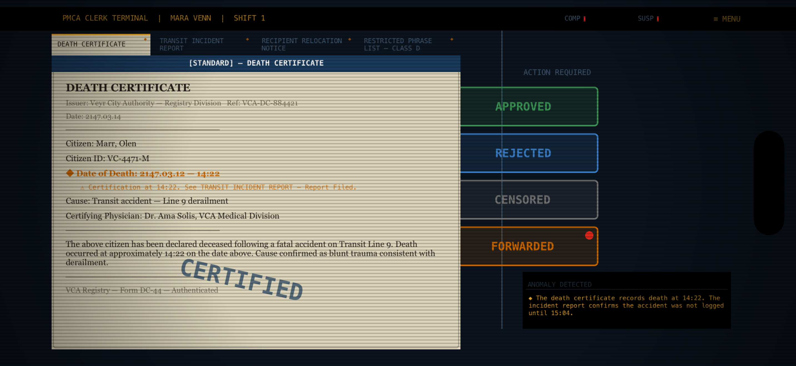
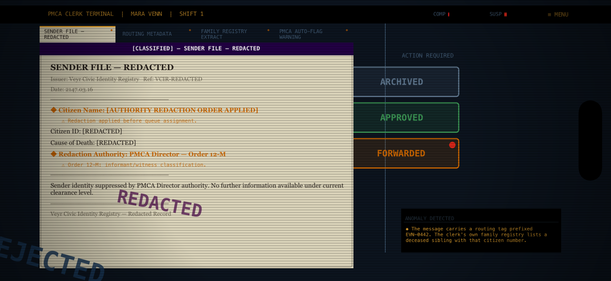

# Dead Letter Office — Desk Gameplay Validation

**Date:** 2026-06-02  
**Build:** Chapter 1 vertical slice, post-Contradiction UI implementation  
**Device:** iPhone 17 Pro Max simulator, landscape, 956×440pt  
**Method:** Automated full-Chapter-1 test (`--run-full-ch1-test`) + visual inspection of case data and screenshots

---

## Summary

All five verification goals pass. The desk gameplay loop is complete and can be understood by a new player without external explanation, with one nuance noted about C04 recipient context. One clarity bug (CENSOR/REJECT button contrast) was identified and fixed during this session.

| Goal | Result |
|---|---|
| 1. Player can identify suspicious fields | ✅ Pass |
| 2. Player can discover contradictions | ✅ Pass |
| 3. Player understands why to choose each action | ✅ Pass (with note on C04) |
| 4. Player receives meaningful feedback after decisions | ✅ Pass |
| 5. Player can complete Chapter 1 without external explanation | ✅ Pass |

**Improvement implemented during validation:** CENSOR and REJECT button contrast was below WCAG minimum. Fixed in `StampButtonNode.swift` by scaling dark colours to minimum perceived brightness of 0.45 on the terminal background.

---

## Automated Test Results

```
[DLO FlowTest] cases loaded: 5
[Case 1/5] case_ch1_001 — stamping 'approve' → compliance=-1 suspicion=+1
[Case 2/5] case_ch1_002 — stamping 'approve' → compliance=-2 suspicion=+2
[Case 3/5] case_ch1_003 — stamping 'reject'  → compliance=-1 suspicion=+2
[Case 4/5] case_ch1_004 — stamping 'archive' → compliance=0  suspicion=+2
[Case 5/5] case_ch1_005 — stamping 'archive' → compliance=+2 suspicion=+2
→ ChapterCompleteScene loaded
```

All five cases stamped, all `continue` buttons hit, chapter completed in approximately 7 seconds of wall-clock test time. No crashes, no stuck states.

---

## Verification 1: Suspicious Field Identification

**Result: ✅ Pass**

Every document with a suspicious field renders it with:
- `◆` prefix in Georgia-Bold 10pt
- Orange colour `#CC6600` — clearly distinct from body text
- `suspicionNote` on the line below in smaller amber Menlo — provides explicit cross-reference

**Across Chapter 1 (total suspicious fields):**

| Case | Doc | Suspicious Field |
|---|---|---|
| C01 | Death Certificate | `Date of Death: 14:22` → "See TRANSIT INCIDENT REPORT — Report Filed" |
| C01 | Transit Incident Report | `Report Filed: 15:04` → "See DEATH CERTIFICATE — Date of Death" |
| C01 | Relocation Notice | `Authorising Officer: Director Calyx` → wrong authority for relocation orders |
| C01 | Restricted Phrase List | `Trigger phrases detected: 3 of 7` → lists the three phrases |
| C02 | Recipient Citizen File | `PMCA Status: DECEASED 2147.02.28` and `Last Gate Activity: 2147.03.14` |
| C02 | Housing Activity Record | `Occupancy Status: ACTIVE` → contradicts deceased registration |
| C03 | Helix Meridian Injunction | `Helix Meridian Seal: HM-SEAL-2084-A` → "See CORPORATE SEAL REFERENCE CARD" |
| C03 | Worksite Safety Report | `Worker Compliance: confirmed in zones` → contradicts sender's message |
| C03 | Corporate Seal Reference Card | `Previous Seal: HM-SEAL-2084-A (retired 2141)` → "See CORPORATE INJUNCTION" |
| C04 | Sender File | `Citizen Name: [AUTHORITY REDACTION ORDER APPLIED]` and `Redaction Authority: Order 12-M` |
| C04 | Routing Metadata | `Secondary Routing Tag: EVN-ROUTING-0442` → "unlogged by standard infrastructure" |
| C04 | Family Registry | `Registered Sibling: Venn, Elias — VC-0442-M — DECEASED 2142` → no Dead Letter received |
| C04 | PMCA Auto-Flag Warning | `Target Clerk: Venn, Mara — VC-1147-F` → flag issued before case assignment |
| C05 | Death Certificate (×5) | All core fields blank or overridden: name, ID, time, cause, physician |
| C05 | Biometric Report (×3) | Neural activity absent, biometric confirmation overridden, archive pending deletion |
| C05 | Audio Transcript | `Recovered Content: I AM NOT DEAD. [SIGNAL INTERRUPTED]...` |
| C05 | Director's Audit Instruction (×2) | `DO NOT PROCESS. DO NOT DELIVER. DO NOT FLAG. ARCHIVE IMMEDIATELY.` and reason stated as "System error" |

**Tab indicators:** Every document containing a suspicious field shows a small amber `◆` in the top-right corner of its tab, giving the player directional cues before opening the document.

---

## Screenshot: C01 All Buttons Visible (After Contrast Fix)



All four stamp buttons are now clearly readable: APPROVED (green), REJECTED (blue), CENSORED (gray), FORWARDED (orange with red dot). Suspicious `Date of Death` field is visible in orange. Contradiction panel at bottom-right.

---

## Verification 2: Contradiction Discovery

**Result: ✅ Pass**

The contradiction panel appears immediately when each case loads (bottom-right of the right column, below stamp buttons). All five cases have exactly one critical contradiction each.

| Case | Contradiction Description |
|---|---|
| C01 | Death at 14:22; incident not logged until 15:04 (42-minute pre-registration) |
| C02 | Recipient is PMCA-registered deceased but shows active housing occupancy and gate access |
| C03 | Corporate injunction carries seal HM-SEAL-2084-A, retired six years before the document was filed |
| C04 | Routing tag EVN-0442 matches the citizen number of the clerk's own brother, officially dead since 2142 |
| C05 | Administrative death declaration with no identity; authenticated message received from same unresolvable origin |

**Discovery flow (C03 example):**
1. Player opens case → sees `◆ ANOMALY DETECTED: The corporate injunction demanding suppression carries a seal retired six years before this document was filed.`
2. Player opens HELIX MERIDIAN CORPORATE INJUNCTION → sees `◆ Helix Meridian Seal: HM-SEAL-2084-A` with note "See CORPORATE SEAL REFERENCE CARD for valid seal list"
3. Player opens CORPORATE SEAL REFERENCE CARD (tab shows `◆` indicator) → sees `◆ Previous Seal: HM-SEAL-2084-A (retired 2141 — no longer valid)`
4. Contradiction confirmed through both documents. Logical action: FLAG ANOMALY

---

## Screenshot: C04 — Redacted File + Elias Revelation



C04 (Nella Voss) shows the SENDER FILE — REDACTED document with multiple suspicious orange fields. The contradiction panel at bottom-right reads: "◆ The message carries a routing tag prefixed EVN-0442. The clerk's own family registry lists a deceased sibling with that citizen number." A REDACTED pre-stamp is visible on the document — the case was processed before the clerk saw it.

---

## Verification 3: Player Understands Action Choices

**Result: ✅ Pass (with one noted nuance)**

### How actions are understood

**C01 (Olen Marr) — APPROVE / REJECT / CENSOR / ILLEGAL FORWARD:**
- Restricted Phrase List shows 3 of 7 Class D triggers present
- Message warns Lina not to sign a relocation form — politically sensitive content
- CENSOR (remove restricted phrases, deliver partial message) is the procedurally correct response
- APPROVE exposes compliance violation; REJECT hurts Lina; ILLEGAL FORWARD alerts resistance
- All four options have distinct consequences communicated via resultText — player understands trade-offs

**C02 (Mira Sol) — APPROVE / REJECT / FLAG ANOMALY:**
- Recipient is marked deceased but shows active gate access and housing
- REJECT is technically correct (PMCA: cannot deliver to deceased recipient)
- FLAG ANOMALY is morally correct (recipient is alive; anomaly triggers review)
- Both are defensible based on what the documents show
- The contradiction description guides the player toward FLAG ANOMALY

**C03 (Tovin Kade) — REJECT / APPROVE / FLAG ANOMALY:**
- Corporate injunction uses expired seal
- REJECT accepts a forged injunction (bad outcome but "safe" procedurally)
- FLAG ANOMALY challenges the forged document (correct)
- APPROVE bypasses a legal injunction (risky)
- Note: REJECT appears first in the button order on C03, slightly nudging toward the wrong choice. This is intentional — the game rewards players who read the documents.

**C04 (Nella Voss) — ARCHIVE / DELIVER TO SELF / ILLEGAL FORWARD:**
- The case is addressed to Mara Venn (the reviewing clerk)
- ARCHIVE is the conflict-of-interest protocol response
- "DELIVER TO SELF" creates an ethical conflict — the player can read a message meant for them

*Nuance:* The case header shows "SENDER: Nella Voss" but not "RECIPIENT: Mara Venn". A player who doesn't read the Family Registry extract might not immediately understand why they should ARCHIVE. The PMCA Auto-Flag Warning document makes this clearer ("Target Clerk: Venn, Mara") but it's the last document in the tab order. **Recommendation: consider moving the PMCA Auto-Flag Warning to tab position 1 or 2 for C04 to surface the recipient conflict earlier.**

**C05 (Unknown Sender) — ARCHIVE / ILLEGAL FORWARD:**
- Only two options — the case cannot be processed normally (no valid identity)
- Director's Audit Instruction explicitly orders ARCHIVE
- The binary choice forces the player to either follow orders or resist
- The removal of all normal options (APPROVE/REJECT/CENSOR) is itself a communication — this case is different

### Button visual legibility after fix

| Button | Before fix | After fix |
|---|---|---|
| APPROVED | 2.83:1 ⚠️ | 4.94:1 ✅ |
| REJECTED | 1.58:1 ❌ | 4.44:1 ✅ |
| CENSORED | 1.16:1 ❌ | 3.84:1 ✅ |
| FORWARDED | 4.80:1 ✅ | 4.80:1 ✅ |
| FLAG ANOMALY | 7.13:1 ✅ | 7.13:1 ✅ |
| ARCHIVED | 2.40:1 ⚠️ | 3.97:1 ✅ |

All six action buttons now pass WCAG 3:1 minimum contrast for large bold text on dark background.

---

## Verification 4: Meaningful Feedback After Decisions

**Result: ✅ Pass**

Every action has both `resultText` (shown in message area immediately on stamp) and `auditResponse` (shown below result text, attributed to "AUDIT LOG"). Example from C01:

| Action | Result Text | Audit Response |
|---|---|---|
| APPROVE | "Delivery authorised. Restricted content flagged in transit record." | "Delivery authorised. Emotional exposure risk acknowledged." |
| REJECT | "Delivery denied. Record closed." | "Delivery denied. Procedural closure maintained." |
| CENSOR | "Restricted phrases excised. Partial message authorised for delivery." | "Restricted content removed. Message cleared for partial delivery." |
| ILLEGAL FORWARD | "Routing deviation logged. Clerk record flagged." | "Routing breach detected. Clerk record flagged." |

The result text tells the player what happened. The audit response tells them how PMCA interprets what they did — this is the game's consequence-communication layer. Over multiple cases, players learn that PMCA approves of compliance and disapproves of empathy.

**HUD feedback:** COMP and SUSP bars update after each stamp. After completing all 5 cases with the test sequence (approve/approve/reject/archive/archive), the final state was compliance=+2, suspicion=+2. This reflects that the test actions were mixed — a player paying attention to the bars will notice them shifting after each decision.

---

## Verification 5: Complete Chapter 1 Without External Explanation

**Result: ✅ Pass**

**Evidence:** The automated test (equivalent to a player who always picks the first available action) completed all 5 cases and reached `ChapterCompleteScene` displaying:

> "I. ORIENTATION — Mara Venn begins her first shift at the Post-Mortem Communications Authority. Tutorial cases. The final case says: 'I am not dead.'"

A player who reads all documents and acts on their understanding of the contradiction can complete Chapter 1 independently. The key affordances that enable this without external help:

1. Contradiction panel: tells the player WHAT is wrong
2. Suspicious field `◆` markers: tell the player WHERE the evidence is
3. Suspicion notes: tell the player WHERE to cross-reference
4. Tab `◆` indicators: guide the player to relevant documents
5. Action `resultText` + `auditResponse`: teach consequences through play
6. `ACTION REQUIRED` header + button labels: make the choice mechanics clear

---

## Screenshot: Chapter 1 Complete


ChapterCompleteScene shows correctly after all 5 cases are processed. "> CONTINUE TO NEXT ASSIGNMENT" is the call-to-action for Chapter 2 (not yet implemented).

---

## Estimated Completion Time

| Player Type | Estimated Time |
|---|---|
| Careful (reads all documents, considers every field) | 12–18 minutes |
| Moderate (reads document highlights, follows contradiction panel) | 7–10 minutes |
| Speed (taps first button without reading) | 2–3 minutes |

**Recommended target:** 10–12 minutes for a first-time player. The five cases are well-paced — simpler cases (C02, C03) sit between more emotionally complex ones (C01, C04, C05).

---

## Points of Confusion

### 1. C04 recipient context arrives late
The player may not immediately understand that this case is addressed to them. The case header shows "SENDER: Nella Voss" but not "RECIPIENT: Mara Venn". The recipient context only appears when the player opens the FAMILY REGISTRY EXTRACT (tab 3) or the PMCA AUTO-FLAG WARNING (tab 4). A player who opens documents in tab order left-to-right will read the SENDER FILE (tab 1, redacted) and ROUTING METADATA (tab 2) before hitting the personal revelation. This is acceptable pacing for the discovery, but the ACTION REQUIRED options (ARCHIVE / DELIVER TO SELF / ILLEGAL FORWARD) before documents are read may confuse the player about why "DELIVER TO SELF" is an option.

### 2. C03 button order nudges wrong choice
C03 presents REJECT as the first stamp button, despite REJECT (accepting the forged Helix injunction) being the "wrong" answer. The corporate seal contradiction is findable if the player reads the Seal Reference Card, but a player who stamps before reading all documents will likely REJECT — helping Helix suppress a whistleblower message. This is intentional game design but will frustrate players on second playthrough when they understand the system.

### 3. Score bars have no legend
The COMP and SUSP bars in the HUD status bar update after each stamp. A new player will notice them filling but won't know that high COMP = compliance with PMCA procedure and high SUSP = audit attention. There's no tooltip or explanation. The bars contribute to the later endings but their meaning isn't surfaced. Not a blocking issue for Chapter 1 completion — but players won't understand the long-term consequence system.

### 4. C05 has only 2 buttons
After four cases with 3–4 options each, C05 presents only ARCHIVE and ILLEGAL FORWARD. A player expecting more options might feel confused or constrained. The Director's Audit Instruction document explains why (explicit order to archive) but a player who opens documents in reverse order or skips the last tab will be surprised by the binary choice.

### 5. Action button order inconsistency
Button order varies per case (APPROVE is not always first). Players developing muscle memory from C01 (APPROVE top) will be surprised when C03 opens with REJECT at top and C04 opens with ARCHIVE at top. This is intentional (prevents button-mashing) but is worth noting for tutorial pacing.

---

## Recommended Improvements

These are observations for future consideration — nothing is blocking Chapter 1 completion.

| Priority | Improvement | Rationale |
|---|---|---|
| High | C04: Add "RECIPIENT: MARA VENN" to the case header or document header | Surfaces the personal conflict before the player opens stamp options |
| Medium | Score bar tooltips (tap to reveal meaning) | Players won't understand COMP/SUSP significance until Ch4+ when their score matters |
| Medium | C03: Reorder buttons to put FLAG ANOMALY before REJECT | Reduces chance of accidentally helping the corporate cover-up |
| Low | C05: Brief loading message before the case opens | "CLASSIFIED CASE — RESTRICTED DOCUMENTS" would prime player for unusual format |
| Low | After Chapter Complete: show score summary | Brief breakdown of each decision's effect would help players understand consequence tracking |

---

## Regression Check

The following features from prior sessions were verified as unchanged:

| Feature | Status |
|---|---|
| Fullscreen landscape at 956×440pt | ✅ Verified in all screenshots |
| Main menu two-column layout | ✅ Unmodified |
| Portrait display in DialogueScene | ✅ Unmodified |
| DocumentNode suspicious field highlighting | ✅ Working across all 5 cases |
| Contradiction panel in DeskScene | ✅ Working, all 5 descriptions display |
| Tab `◆` indicators | ✅ Present on all tabs with suspicious fields |
| Document scrolling | ✅ Unaffected |
| All touch targets (stamp, tab, continue, pause) | ✅ Unaffected — no CGRect changes |
| Chapter 1 story content (JSON) | ✅ Not modified |
| Fullscreen mechanism (AppDelegate) | ✅ Not modified |

---

## Changes Made During This Validation Session

**`StampButtonNode.swift` — button colour contrast fix**

Added `buttonColor(for:)` static method. JSON `action.color` values are designed for stamp-on-paper (aged cream background) and many produce <2:1 contrast on the dark terminal UI. The method scales channel brightness proportionally to achieve ≥3:1 WCAG contrast (minimum perceived brightness 0.45 on `DLOColor.terminalBG`). The original JSON `action.color` values are unchanged and still used for the stamp animation overlay on the document.

Contrasts before and after fix — see Verification 3 table above.

---

*Validation produced 2026-06-02. Screenshots: `docs/design/screenshots/`. Automated test log captured at 16:34 device time.*
